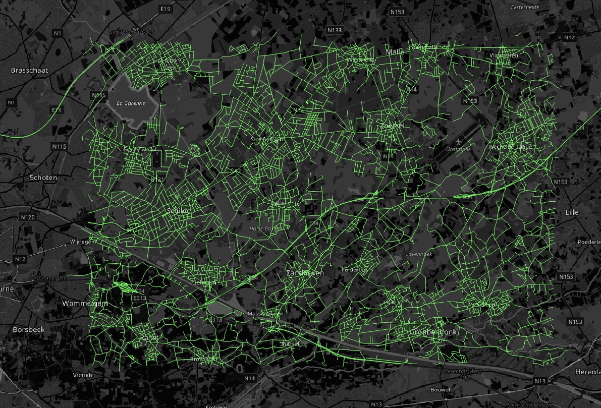

# itinero-io-osm-tiles

An IO project for itinero 1 to consume routable tiles.

## Usage

```
// create a routerdb.
var routerDb = new RouterDb();
            
// specify what vehicles it should support.
routerDb.AddSupportedVehicle(Itinero.Osm.Vehicles.Vehicle.Car);
            
// start loading tiles.
routerDb.LoadOsmDataFromTiles(new Box(51.179773424875634f, 4.5366668701171875f,
   51.29885215199866f, 4.8017120361328125f));
   
// routing code here!
```

This results in this network begin loaded:


